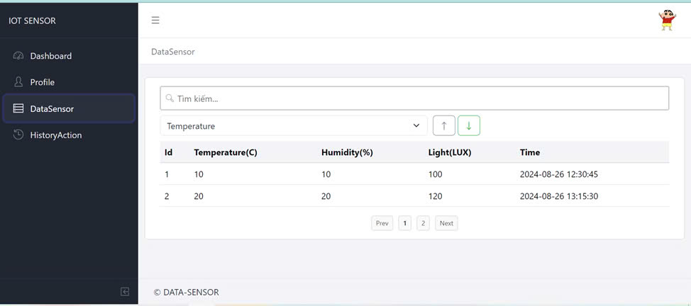
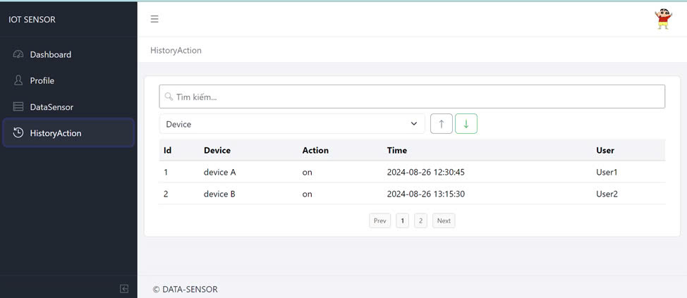
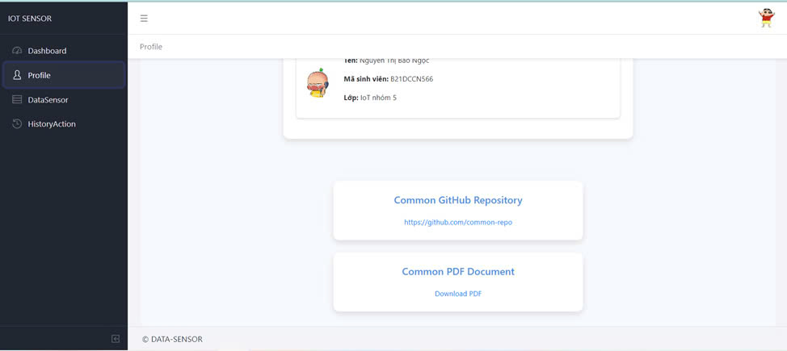

# IoT DATA-SENSER
# Trang DashBoard

# Trang DataSensor

# Trang History

# Trang Profile



This is a simple website that helps users easily monitor temperature, humidity, and light indicators in the room and control electronic devices!


## Versions

* [CoreUI Free Bootstrap Admin Template](https://github.com/coreui/coreui-free-bootstrap-admin-template)
* [CoreUI Free Angular Admin Template](https://github.com/coreui/coreui-free-angular-admin-template)
* [CoreUI Free React.js Admin Template (Vite)](https://github.com/coreui/coreui-free-react-admin-template)
* [CoreUI Free React.js Admin Template (Create React App)](https://github.com/coreui/coreui-free-react-admin-template-cra)
* [CoreUI Free Vue.js Admin Template](https://github.com/coreui/coreui-free-vue-admin-template)

### Installation

``` bash
$ npm install
```

or

``` bash
$ yarn install
```

### Basic usage

``` bash
# dev server with hot reload at http://localhost:3000
$ npm start 
```

or 

``` bash
# dev server with hot reload at http://localhost:3000
$ yarn start
```

Navigate to [http://localhost:3000](http://localhost:3000). The app will automatically reload if you change any of the source files.

#### Build

Run `build` to build the project. The build artifacts will be stored in the `build/` directory.

```bash
# build for production with minification
$ npm run build
```

or

```bash
# build for production with minification
$ yarn build
```

## What's included

Within the download you'll find the following directories and files, logically grouping common assets and providing both compiled and minified variations. You'll see something like this:

```
coreui-free-react-admin-template
├── public/          # static files
│   ├── favicon.ico
│   └── manifest.json
│
├── src/             # project root
│   ├── assets/      # images, icons, etc.
│   ├── components/  # common components - header, footer, sidebar, etc.
│   ├── layouts/     # layout containers
│   ├── scss/        # scss styles
│   ├── views/       # application views
│   ├── _nav.js      # sidebar navigation config
│   ├── App.js
│   ├── index.js
│   ├── routes.js    # routes config
│   └── store.js     # template state example 
│
├── index.html       # html template
├── ...
├── package.json
├── ...
└── vite.config.mjs  # vite config
```

